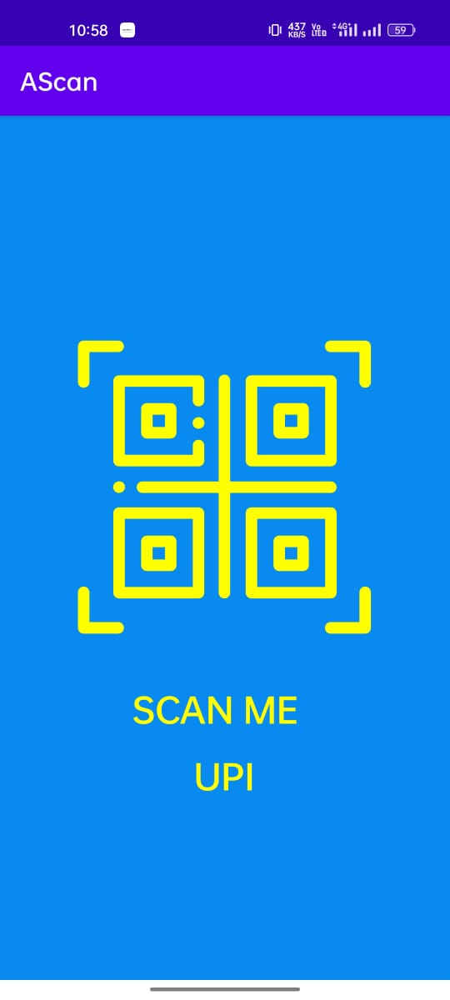
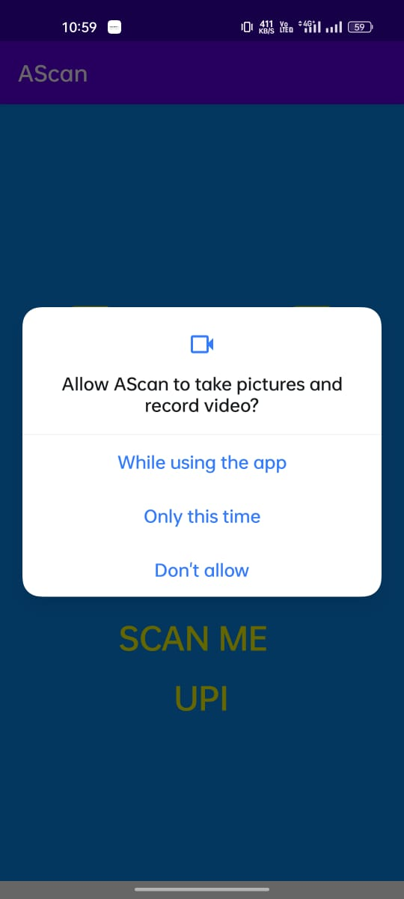
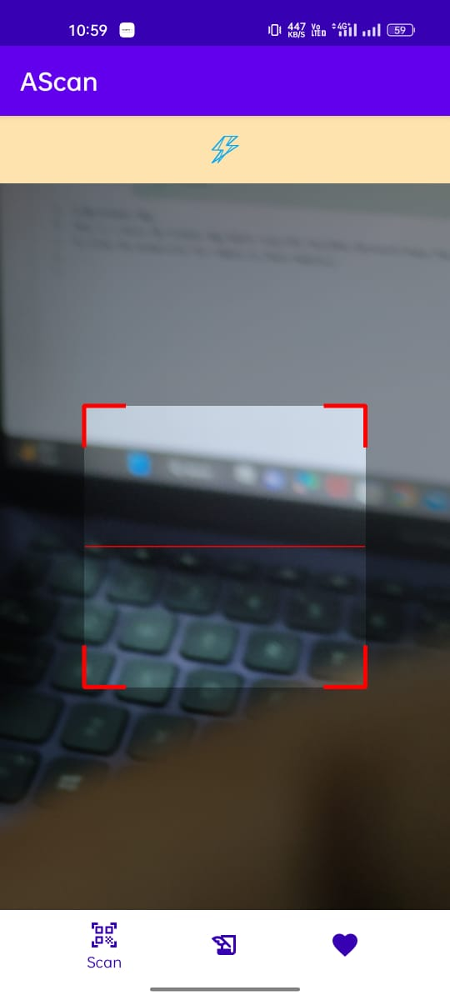
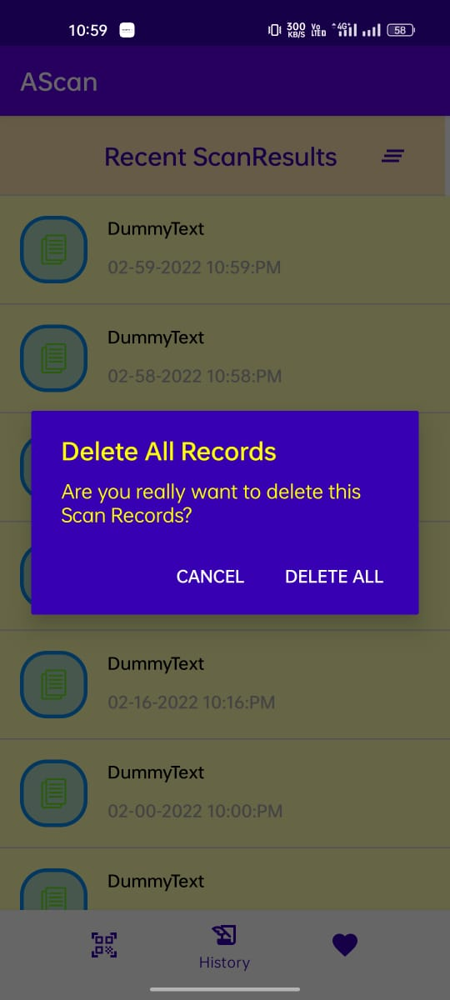
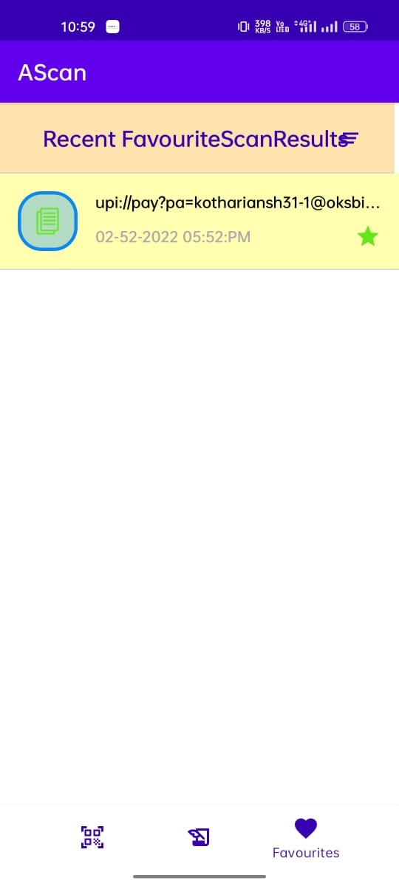

# QR-Scanner-App
This is a basic QR Scanner App which Scan UPI ID,other QR which have the personal information like in Aadhar card.It consist of three fragments.
## Splash Screen
This is the splash screen of the app.

## Demo
A link of demo 
* https://drive.google.com/file/d/16BEg9oXVZRdyqiKe69u0MLiU0dII9e9t/view

## Tech Stacks

 
At first, User have 
to allow the permission for camera in their mobile. 

 
Here,Home Screen contains the screen and the flash options for detect the QR Code 

 
Now,It has the also the options for Save the records of all the scans and also the options for remove it from database of our app.

 
we can share ,copy on clipboard  the scan results also and market it as favourite option also ,for differentiate them.

 
here,we have also the options for delete all the scan results.

 
There is another page for display all the favourite scan results to access  them easily.

 

## Color Reference

| Color             | Hex                                                                |
| ----------------- | ------------------------------------------------------------------ |
|  White |  #FFFFFF |
|  Prple Color |  #B2A4FF |
|  grey |  #c5c5c5 |
|  dark Prple Color |  #AA77FF |

## Features

- Fullscreen mode
- scan QRs 
- store all the history of Scan results
- CRUD Operations
- Added to favourite with time and date

  
## 🚀 About Me
I'm a Btech student of IIIT Allahabad. I have currently learned Android development in Kotlin and made some apps by the use of firebase authentication  and its realtime database

## 🔗 Links

## Installation
download the apk from my github repository.
for code you can use git clone~.
    

## Lessons Learned
In the developing this app, I learnt alot of things about firebase database and storage , how they can manage and shown on the screen .
Other things I have also learn about the architecture of an app like MVVM and others.

## Support

For support, email luciferabhinavdevil666@gmail.com.

